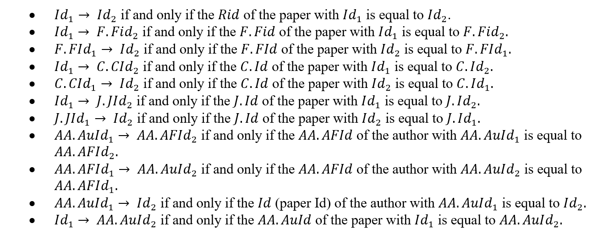

&emsp;&emsp;上周参加编程之美复赛，在和两个小伙伴的共同努力下，最终复赛取得了第22名的成绩，很遗憾没有进入决赛。但在这次比赛中，也学到了许多东西，在这里总结一下。
# 赛题介绍
Microsoft Academic Graph (MAG) is a large heterogeneous graph containing entities such as authors, papers, journals, conferences and relations between them. Microsoft provides [Academic Knowledge API](https://www.microsoft.com/cognitive-services/en-us/academic-knowledge-api) for this contest. The Entity attributes are defined [here](https://www.microsoft.com/cognitive-services/en-us/academic-knowledge-api/documentation/EntityAttributes).

Participants are supposed to provide a REST service endpoint that can find all the 1-hop, 2-hop, and 3-hop graph paths connecting a given pair of entity identifiers in MAG. The given pair of entity identifiers could be [Id, Id], [Id, AA.AuId], [AA.AuId, Id], [AA.AuId, AA.AuId]. Each node of a path should be one of the following identifiers: Id, F.Fid, J.JId, C.CId, AA.AuId, AA.AfId. Possible edges (a pair of adjacent nodes) of a path are:

For each test case, the REST service endpoint will receive a JSON array via HTTP with a pair of entity identifiers, where the identifiers are 64-bit integers, e.g. [123, 456]. The service endpoint needs to respond with a JSON array within 300 seconds. The response JSON array consists of a list of graph paths in the form of [path1, path2, …, pathn], where each path is an array of entity identifiers. For example, if your program finds one 1-hop paths, two 2-hop paths, and one 3-hop paths, the results may look like this: [[123,456], [123,2,456], [123,3,456], [123,4,5,456]]. For a path such as [123,4,5,456], the integers are the identifiers of the entities on the path. After receiving the response, the evaluator will wait for a random period of time before sending the next requests.

# 赛题分析
**简单总结：**赛题的核心问题在于，寻找从给定的起点到给定的终点的路径。其中起点和终点可以是论文Id或者作者AuId,路径中的节点间指向关系如上图所示，路径的长度为小于或等于3。

## 初始阶段
&emsp;&emsp;初始阶段，我们我们试图从起点开始，根据图1的节点关系从前向后拓展，直至找到终结点或跳数超过限制。这是一种“大一统”的算法，如果存在可行方案，当跳数限制修改时，此算法仍旧实用。为此我们绘制了如下状态转移图（由于时间有限，图中可能有某些细节存在问题）：

&emsp;&emsp;经过初步设计，我们根据这个示意图编写出了第一版的代码，然而跑出来的结果却让人很不满意，有些测试用例根本没有计算出结果或者计算超时。于是，我们开始讨论原因以及解决方案。  

**主要原因：**当我们以id或auid为查询条件查询时，获得的数据量并不大，但当我们以FId(研究领域Id)、JId(期刊Id)、Cid(会议Id)为查询条件时，获取的数据量确实巨大的。大到我们根本无法处理。所以才会出现无法继续探路的情况。
**解决方案**
从两端出发，而不是单纯的从一端出发，即从start和end同时向中间汇聚。不去进行FId、JId、FId的查询。

## 进阶阶段
&emsp;&emsp;根据从两端出发的指导思想，以减少请求次数为设计目标，分别为Id-Id/Id-AuId/AuId-Id/AuId-AuId四种情况进行了如下设计：

&emsp;&emsp;经过这次设计，整个思路就非常清晰了，自然程序也就水到渠成。

# 项目工程和管理相关内容
## 项目架构
- RESTFul架构：选择SpringMVC框架作为RESTFul架构实现方式。
- JSON解析：FastJSON
- Http请求：Apache HttpClient
- Web服务器：Tomcat
- 项目构建：Maven

## 项目优化
- 多线程优化：采用CachedThreadPool线程池对程序优化，实验发现，CachedThreadPool要优于FixedThreadPool。
- Http请求优化：这部分有所欠缺，由于疏忽，这部分并未进行优化，可以建立TCP长连接，以减少连接创建消耗。

## 项目成员交流相关内容
- SVN：进行代码同步
- OneNote：进行文档同步和交流
- WeChat/QQ：进行即时通信

## 项目代码
[AcademicSearch](https://github.com/ZongWenlong/AcademicSearch)

## 项目总结
- 盲目设计、盲目开发：在比赛开始阶段，对赛题分析不够清晰，浪费了很多时间。比如：根据FId查询会产生大量无用结果，这个问题，可以通过简单的测试就可以发现，但我们在初期并未察觉。
- Just do it：原本在项目开始时，我们就意识到请求连接部分就是一个优化内容，但由于我们后期的疏忽，直到比赛结束我们也没有实际进行优化。
- 团队精神很重要：感谢两位小伙伴。比赛过程中大家一起讨论问题，一起解决问题，相互激发灵感，优势互补。   

&emsp;&emsp;比赛结束了，遗憾的是没能进入决赛，幸运的是认识了两个小伙伴，并在比赛中学到了许多东西，蛮好。
&emsp;&emsp;Never give up! Be more confident!

